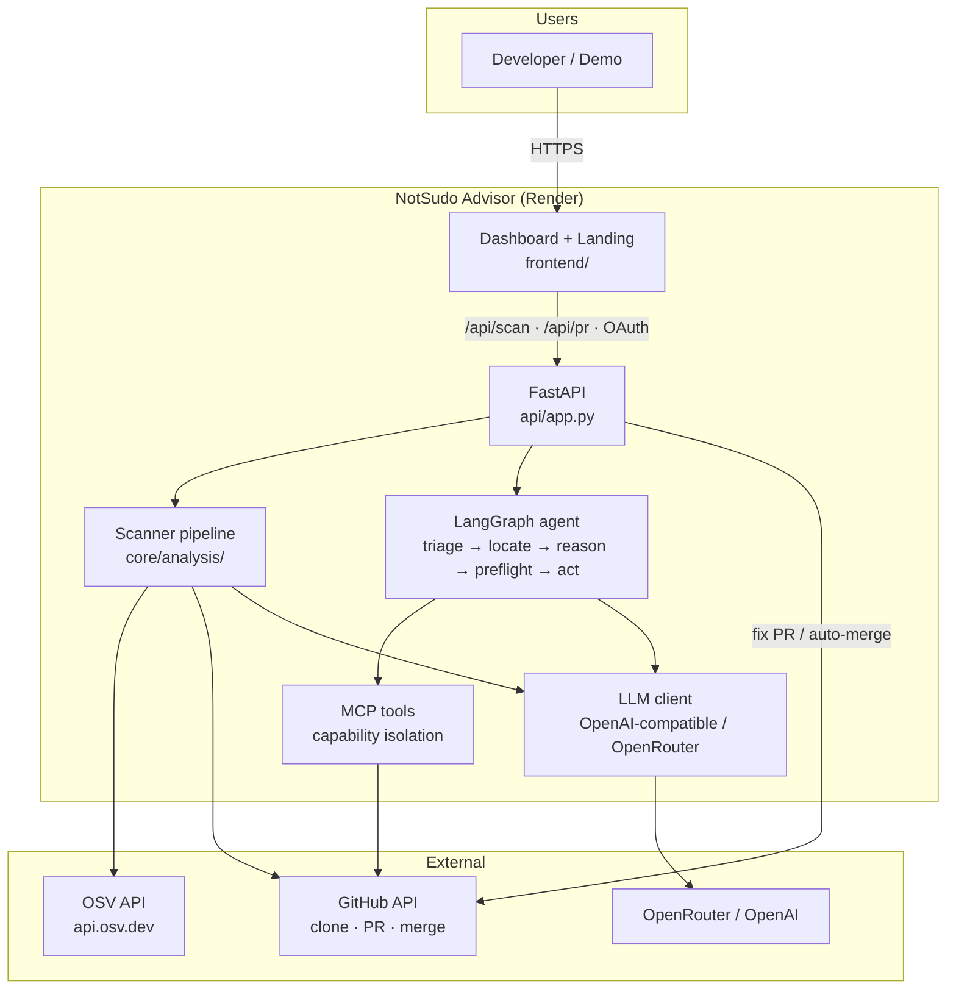
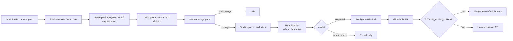
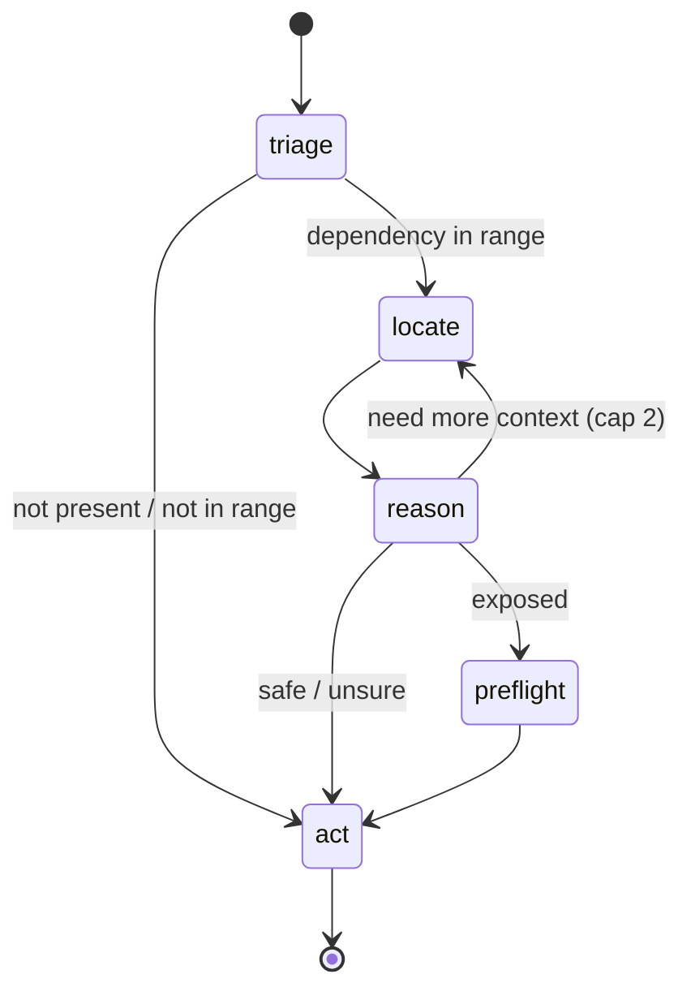

# NotSudo Advisor

**Dependabot flags packages. NotSudo flags only what your code can actually hit — then opens (and optionally merges) a fix PR with cited evidence.**

[](https://github.com/ashokDevs/notsudo-advisor/actions/workflows/ci.yml)
[](https://notsudo-advisor.onrender.com/Dashboard.html)
[](https://www.python.org/)
[](https://github.com/ashokDevs/notsudo-advisor)

---

## Links

| | URL | Description |
|--|-----|-------------|
| **Live app** | [https://notsudo-advisor.onrender.com/Dashboard.html](https://notsudo-advisor.onrender.com/Dashboard.html) | Production dashboard — scan any public GitHub repo |
| **Health** | [https://notsudo-advisor.onrender.com/api/health](https://notsudo-advisor.onrender.com/api/health) | Live config status (LLM, OAuth, PAT, auto-merge) |
| **Landing** | [https://notsudo-advisor.onrender.com/](https://notsudo-advisor.onrender.com/) | Product landing page |
| **Source** | [github.com/ashokDevs/notsudo-advisor](https://github.com/ashokDevs/notsudo-advisor) | Full codebase |
| **Deploy guide** | [`docs/DEPLOY_ONLINE.md`](docs/DEPLOY_ONLINE.md) | Render / Docker / ngrok |
| **Demo script** | [`docs/demo_script.md`](docs/demo_script.md) | 90-second pitch talk track |
| **System design** | [`docs/system_design.md`](docs/system_design.md) | HLD, threat model, eval |
| **Idea / product** | [`docs/idea.md`](docs/idea.md) | Framing & roadmap |
| **OSV** | [osv.dev](https://osv.dev) | Advisory data source (no API key) |

---

## Description

NotSudo is an **agentic dependency security advisor**. It:

1. **Ingests** public vulnerability data from [OSV](https://osv.dev) for packages in `package.json` / lockfiles / Python manifests  
2. **Matches versions** with proper semver / OSV ranges (not “present ⇒ vulnerable”)  
3. **Finds call sites** in your source (imports + syntactic calls)  
4. **Judges reachability** — `exposed` / `safe` / `unsure` — via heuristics or LLM (OpenRouter / OpenAI-compatible)  
5. **Validates evidence quotes** against real file text (anti-hallucination)  
6. **Opens a fix PR** on GitHub (scanned repo) and can **auto-merge** when configured  

### Why it exists

Most tools (Dependabot, basic SCA) report **presence**. Engineers mute them.  
NotSudo answers: **can production code reach the vulnerable path?** and ships a **version bump PR** with evidence.

---

## Architecture

### High-level system



### Scan & fix data flow



### LangGraph agent nodes



| Node | Role |
|------|------|
| **triage** | Fetch advisory, match package + semver, early exit |
| **locate** | Call-site / import discovery |
| **reason** | Reachability + grounded evidence quotes |
| **preflight** | Lockfile / manifest bump sanity |
| **act** | Format PR; only this path may call side-effect tools |

### Security: capability isolation

Advisory text is **attacker-controlled**. Side-effecting tools (`pr_create`) are **not** available to nodes that ingest raw advisory prose.

```mermaid
flowchart TB
  subgraph Untrusted
    ADV[Advisory body from OSV/GHSA]
  end

  subgraph Read_only["Read-only nodes"]
    T[triage]
    L[locate]
    R[reason]
  end

  subgraph Side_effects["Side-effect nodes only"]
    A[act / draft_pr]
  end

  ADV -->|delimited as data| T
  ADV -->|never raw in PR decision| A
  T --> L --> R
  R -->|structured verdict only| A
  A -->|pr_create| GH[(GitHub API)]

  style Side_effects fill:#2d4a3e,stroke:#3ecf8e
  style Untrusted fill:#4a2d2d,stroke:#ef4444
```



Enforced in code: `core/security/capability_graph.py` · tested in `tests/unit/test_capability_graph.py`.

### Repository layout

```text
notsudo-advisor/
├── api/                 # FastAPI — scan, OAuth, PR, health
├── frontend/            # Dashboard + landing (static HTML/JSX)
├── core/
│   ├── analysis/        # pipeline, semver, call sites, reachability, preflight
│   ├── orchestration/   # LangGraph graph + nodes
│   ├── security/        # TOOL_PERMISSIONS + CapabilityGraph
│   ├── llm/             # OpenAI-compatible client (OpenRouter)
│   ├── ingestion/       # OSV, chunker, repo/advisory ingesters
│   └── action/          # PR body formatting
├── mcp_server/          # MCP tools with authorize()
├── cli/                 # notsudo scan | analyze | demo | run-pipeline
├── demo_app/            # Intentionally outdated npm deps for demos
├── eval/                # Ground-truth harness
├── docs/                # Design + deploy docs
├── Dockerfile           # Production image (includes git)
└── render.yaml          # Render blueprint
```

---

## Live demo walkthrough

1. Open **[Dashboard](https://notsudo-advisor.onrender.com/Dashboard.html)** (free tier may take ~30–60s to wake)  
2. Scan:
   - `demo_app` (bundled vulnerable sample), or  
   - `https://github.com/OWASP/NodeGoat`  
3. Default filter: **exposed**  
4. Expand a row → call sites `file:line` + reasoning  
5. **Open fix PR** / **Apply fix (open + merge)** if `GITHUB_AUTO_MERGE=true`  
6. PRs open on the **scanned GitHub repo** (not a random demo repo, unless you only scanned local `demo_app`)

---

## Features

| Feature | Status |
|--------|--------|
| Live OSV scan (npm + PyPI manifests) | ✅ |
| Semver / OSV range matching | ✅ |
| Call-site finder (imports + calls) | ✅ |
| Reachability: exposed / safe / unsure | ✅ |
| LLM via OpenRouter / OpenAI-compatible API | ✅ |
| Heuristic fallback without LLM key | ✅ |
| Evidence quote validation | ✅ |
| GitHub URL clone → scan → cleanup | ✅ |
| Fix PR on **scanned** repo | ✅ |
| Auto-merge (`GITHUB_AUTO_MERGE`) | ✅ |
| GitHub OAuth Sign in | ✅ |
| PAT (`GITHUB_TOKEN`) without browser login | ✅ |
| Capability isolation tests | ✅ |
| Docker + Render deploy | ✅ |
| CLI + eval harness | ✅ |

---

## Tech stack

| Layer | Technology |
|-------|------------|
| API | FastAPI, Uvicorn, Starlette sessions |
| Agent | LangGraph, LangChain OpenAI client |
| LLM | OpenRouter / any OpenAI-compatible base URL |
| Data | OSV HTTP API, GitHub REST API |
| Analysis | Pure Python semver, regex/call-site finder, tree-sitter chunker |
| Optional DB | Postgres + pgvector (index / RAG path) |
| Frontend | Static React-via-Babel JSX + CSS tokens |
| Deploy | Docker on [Render](https://render.com) |

---

## Quick start (local)

```bash
# Python 3.12+
python -m venv .venv
# Windows: .venv\Scripts\activate
# macOS/Linux: source .venv/bin/activate

pip install -e ".[dev]"
cp .env.example .env
# Edit .env — see Environment section below

python -m uvicorn api.app:app --reload --port 8080
# → http://127.0.0.1:8080/Dashboard.html
```

```bash
python -m cli.main scan demo_app
python -m cli.main scan https://github.com/OWASP/NodeGoat
python -m cli.main demo
```

---

## Environment variables

| Variable | Required | Description |
|----------|----------|-------------|
| `APP_BASE_URL` | Online yes | Site origin, e.g. `https://notsudo-advisor.onrender.com` (**no** `/Dashboard.html`) |
| `OPENAI_API_KEY` | For LLM | OpenRouter `sk-or-…` or OpenAI `sk-…` |
| `OPENAI_API_BASE` | For OpenRouter | `https://openrouter.ai/api/v1` |
| `LLM_MODEL` | Optional | e.g. `openrouter/auto` |
| `GITHUB_TOKEN` | For PRs | Fine-grained PAT: **Contents + Pull requests = write** |
| `GITHUB_DEMO_REPO` | Local demo PRs | Fallback when scanning local `demo_app` |
| `GITHUB_CLIENT_ID` / `SECRET` | OAuth UI | GitHub OAuth App credentials |
| `GITHUB_AUTO_MERGE` | Optional | `true` → open PR **and merge** |
| `GITHUB_MERGE_METHOD` | Optional | `squash` (default) / `merge` / `rebase` |
| `SESSION_SECRET` | Online yes | Long random string |
| `NOTSUDO_HASH_EMBEDDINGS` | Optional | `1` skips heavy embedding model download |

**OAuth callback (GitHub App settings):**  
`https://notsudo-advisor.onrender.com/auth/github/callback`

---

## API surface

| Method | Path | Description |
|--------|------|-------------|
| `GET` | `/api/health` | Live status (no secrets) |
| `GET` | `/api/me` | Session user + config flags |
| `GET` | `/api/github/status` | Can this token push/merge? |
| `POST` | `/api/scan` | `{ "target": "owner/repo" \| path \| URL }` |
| `POST` | `/api/pr` | Open fix PR (`auto_merge` optional) |
| `GET` | `/auth/github/login` | Start OAuth |
| `GET` | `/auth/github/callback` | OAuth return |

---

## Deploy online

```bash
# Docker
docker build -t notsudo .
docker run --rm -p 8080:8080 --env-file .env \
  -e APP_BASE_URL=https://your-host \
  notsudo
```

Or connect this repo to [Render](https://dashboard.render.com) with the included `Dockerfile` / `render.yaml`.  
Details: **[docs/DEPLOY_ONLINE.md](docs/DEPLOY_ONLINE.md)**.

---

## Tests & quality

```bash
ruff check .
mypy .
pytest tests/unit tests/test_smoke.py -q
```

CI runs on every push to `main`: lint → mypy → pytest  
→ [Actions](https://github.com/ashokDevs/notsudo-advisor/actions)

---

## Honest limitations

- Call-site finding is **syntactic** (misses dynamic `obj[name]()` dispatch)  
- Without an LLM key, verdicts use strong heuristics  
- Online: scan **GitHub URLs**, not local disk paths like `D:\...`  
- Fix PRs need write access on the **target** repo  
- Free Render sleeps when idle — first request can be slow  

---

## Project docs

| Document | Purpose |
|----------|---------|
| [`docs/idea.md`](docs/idea.md) | Product idea & scope |
| [`docs/system_design.md`](docs/system_design.md) | Architecture deep dive |
| [`docs/tdd_design.md`](docs/tdd_design.md) | Testing strategy |
| [`docs/coding_rules.md`](docs/coding_rules.md) | Hard engineering rules |
| [`docs/demo_script.md`](docs/demo_script.md) | Live demo script |
| [`docs/DEPLOY_ONLINE.md`](docs/DEPLOY_ONLINE.md) | Production deploy |
| [`CLAUDE.md`](CLAUDE.md) | Operator notes for AI assistants |

---

## License

See repository owner for license terms.

---

<p align="center">
  <a href="https://notsudo-advisor.onrender.com/Dashboard.html"><strong>Open the live Dashboard →</strong></a>
  ·
  <a href="https://github.com/ashokDevs/notsudo-advisor">Star on GitHub</a>
</p>
